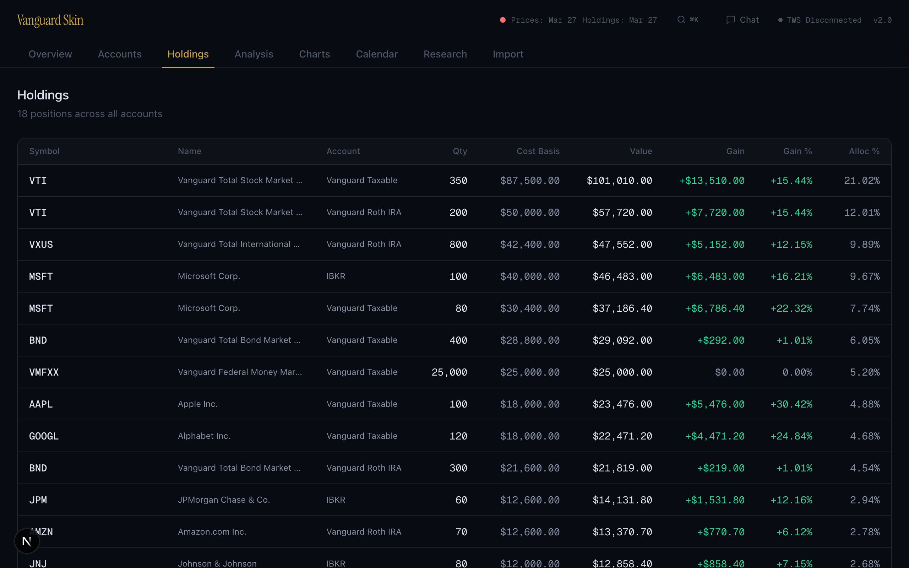

# Vanguard Skin

[](LICENSE)
[](https://nextjs.org)
[](https://typescriptlang.org)
[](#testing)
[](https://www.electronjs.org/)

A local-first portfolio dashboard for tracking Vanguard and Interactive Brokers investments. Import brokerage statements, sync live positions via TWS, and analyze your portfolio with AI-powered chat, trade reviews, research feeds, scenario modeling, and automated briefings. Available as a web app or native macOS desktop app.


---

## Features

<table>
<tr>
<td width="33%" valign="top">
<h3>Portfolio Overview</h3>
Combined equity curves across all accounts with daily resolution. Performance metrics (TWR, XIRR) for YTD, 1Y, 3Y, 5Y, and custom date ranges. Benchmark comparison against SPY, QQQ, and VTI with dollar and percent toggle.
</td>
<td width="33%" valign="top">
<h3>Multi-Source Import</h3>
Import from 9 formats: Vanguard PDF statements (parsed via Claude AI), IBKR activity and holdings CSVs, cost basis CSVs, monthly value snapshots, factor CSVs, and a universal canonical CSV format. Deterministic deduplication with pre-commit validation.
</td>
<td width="33%" valign="top">
<h3>Live TWS Integration</h3>
Sync positions, account balances, and streaming quotes directly from IBKR Trader Workstation. Historical OHLCV bars for per-security candlestick charting with SMA overlays and buy/sell transaction markers.
</td>
</tr>
<tr>
<td width="33%" valign="top">
<h3>AI Chat</h3>
Ask questions about your portfolio using Claude with 17 database tools. Agentic loop with multi-step tool use, grounded entirely in your real portfolio data. Anti-hallucination guardrails ensure factual answers.
</td>
<td width="33%" valign="top">
<h3>Tax Lot Tracking</h3>
FIFO cost lot matching with wash sale detection (30-day window). Realized and unrealized gain/loss by year, account, and security. Form 8949 CSV export and TurboTax TXF format. Supports stocks, options, and bonds with par adjustment.
</td>
<td width="33%" valign="top">
<h3>Trade Reviews</h3>
Monthly AI trade analysis powered by Claude. Round-trip reconstruction from tax lots, letter grades (A-F) per trade, pattern identification, and actionable recommendations. Account-specific profiles for IBKR, Vanguard, and Roth accounts.
</td>
</tr>
<tr>
<td width="33%" valign="top">
<h3>Risk & Factor Analysis</h3>
Max drawdown, portfolio volatility, Sharpe ratio, and Herfindahl concentration. Per-position risk contribution with correlation matrices. Quantitative factor exposure (size, style, value, growth, momentum, quality) with market beta regression.
</td>
<td width="33%" valign="top">
<h3>Scenario Modeling</h3>
9 preset scenarios (market crash, rate shocks, rally, sector rotation, stagflation) plus custom what-if analysis. Position-level impact estimates based on factor exposures and historical sensitivities.
</td>
<td width="33%" valign="top">
<h3>Research Calendar</h3>
Earnings dates and company events via IBKR Wall Street Horizon. Macro events (FOMC, CPI, jobs) from FRED. AI-generated weekly briefings with automated email delivery. Daily research digests from newsletter feeds.
</td>
</tr>
<tr>
<td width="33%" valign="top">
<h3>Research Feeds</h3>
Gmail newsletter ingestion via OAuth 2.0. AI-powered article processing with per-source custom prompts. Sentiment analysis, ticker extraction, and security linking. Reader-mode UI with expandable full-text articles.
</td>
<td width="33%" valign="top">
<h3>Security Detail Hub</h3>
Per-security page with candlestick chart, cross-account positions, tax lots, transactions, notes, calendar events, and factor exposure. Every symbol in the app links here. Watchlist with price targets and thesis tracking.
</td>
<td width="33%" valign="top">
<h3>Desktop App</h3>
Native macOS app via Electron with code-signed and notarized DMG. System tray with portfolio summary, TWS auto-connect, auto-updates via GitHub Releases, and first-run onboarding. Same features as the web app.
</td>
</tr>
</table>

### Also includes

- **Global search** with Command Palette (Cmd+K) across securities, notes, and transactions
- **Watchlist** for tracking securities not yet owned, with price targets and investment thesis
- **Options Greeks** (Black-Scholes delta, gamma, theta, vega, IV) and strategy detection (covered calls, spreads)
- **Cost basis reconciliation** comparing broker-reported vs. computed cost basis
- **Corporate actions** (stock splits, reverse splits) with full historical adjustment across all tables
- **Data Health dashboard** showing price coverage, data freshness, gaps, and cross-source discrepancies
- **Morning briefing** widget with daily market context on the Overview tab
- **Automated emails** via launchd: weekly calendar briefings (Sunday 5 PM) and daily research digests (weekday 9 AM)
- **Income tracking** for dividends, interest, and reinvestments
- **Period comparison** tables for multi-period performance analysis

---

## Screenshots

<details>
<summary>Account Details</summary>


</details>

<details>
<summary>Holdings</summary>


</details>

<details>
<summary>Analysis</summary>


</details>

<details>
<summary>Charts</summary>


</details>

<details>
<summary>Calendar</summary>


</details>

<details>
<summary>Trade Reviews</summary>


</details>

<details>
<summary>Research Feeds</summary>


</details>

<details>
<summary>Security Detail</summary>


</details>

<details>
<summary>Data Health</summary>


</details>

<details>
<summary>AI Chat</summary>


</details>

<details>
<summary>Import</summary>


</details>

---

## Tech Stack

| Layer | Technology |
|-------|-----------|
| Framework | Next.js 16, React 19 |
| Language | TypeScript 5 |
| Database | SQLite via better-sqlite3 (WAL mode) |
| Styling | Tailwind CSS 4 |
| Charts | Recharts (portfolio), LightweightCharts v5 (candlestick) |
| AI | Claude API via AI SDK v6 (Opus for reviews, Sonnet for classification) |
| Broker API | IBKR TWS via @stoqey/ib |
| Email | Gmail API (OAuth 2.0) for research feeds, Nodemailer for outbound |
| Desktop | Electron + electron-builder (code-signed macOS DMG) |
| Testing | Vitest (687 tests across 58 files) |

---

## Quick Start

### Prerequisites

- **Node.js 20+** (via Homebrew: `brew install node`)
- **npm 10+**
- **Anthropic API key** ([get one here](https://console.anthropic.com/)) -- required for PDF parsing and AI chat
- **IBKR Trader Workstation** (optional) -- for live data features

### Setup

1. **Clone the repository**
   ```bash
   git clone https://github.com/itsme188/vanguard-skin.git
   cd vanguard-skin
   ```

2. **Install dependencies**
   ```bash
   npm install
   ```

3. **Configure environment variables**
   ```bash
   cp .env.local.example .env.local
   ```
   Edit `.env.local` and add your Anthropic API key at minimum. See [Configuration](#configuration) for all available options.

4. **Start the development server**
   ```bash
   npm run dev
   ```

5. **Open http://localhost:3000** in your browser

The SQLite database is created automatically on first run with all 21 migrations applied.

### Demo Data

To explore the dashboard with sample data before importing your own:

```bash
npx tsx scripts/seed-demo.ts --replace
```

This populates the database with 6 months of fictional portfolio data across three accounts.

### Desktop App

A macOS desktop app (DMG) is available from [GitHub Releases](https://github.com/itsme188/vanguard-skin/releases). It includes all the same features with a native system tray, TWS auto-connect, and automatic updates. To build locally:

```bash
npm run electron:pack
```

---

## Configuration

<details>
<summary>Environment Variables</summary>

Copy `.env.local.example` to `.env.local` and configure:

**Required:**
| Variable | Description |
|----------|-------------|
| `ANTHROPIC_API_KEY` | Claude API key for PDF parsing, chat, trade reviews, and classification |

**Required for TWS features:**
| Variable | Description |
|----------|-------------|
| `IBKR_ACCOUNT_CODE` | Your personal IBKR account ID (e.g., `U12345678`) |

**Optional — Calendar & Research:**
| Variable | Description |
|----------|-------------|
| `FRED_API_KEY` | FRED economic calendar data ([free registration](https://fred.stlouisfed.org/docs/api/api_key.html)) |
| `EDGAR_CONTACT_EMAIL` | SEC EDGAR API fair access email |
| `API_NINJAS_API_KEY` | Earnings transcripts ([api-ninjas.com](https://api-ninjas.com/)) |

**Optional — Email Briefings:**
| Variable | Description |
|----------|-------------|
| `GMAIL_ADDRESS` | Gmail address for sending weekly briefings and daily digests |
| `GMAIL_APP_PASSWORD` | Gmail App Password ([setup guide](https://support.google.com/accounts/answer/185833)) |
| `BRIEFING_EMAIL_TO` | Briefing email recipient |

**Optional — Research Feeds (Gmail newsletter ingestion):**
| Variable | Description |
|----------|-------------|
| `GOOGLE_CLIENT_ID` | Google Cloud OAuth client ID |
| `GOOGLE_CLIENT_SECRET` | Google Cloud OAuth client secret |
| `GOOGLE_REFRESH_TOKEN` | Generated via `npx tsx scripts/gmail-oauth-setup.ts` |

</details>

<details>
<summary>IBKR TWS Setup</summary>

To use live data features (position sync, streaming quotes, charting):

1. Open TWS and log in
2. Go to **Edit > Global Configuration > API > Settings**
3. Enable **"ActiveX and Socket Clients"**
4. Set Socket Port to **7496**
5. Add **127.0.0.1** to Trusted IPs
6. Set `IBKR_ACCOUNT_CODE` in your `.env.local`

The dashboard header shows a TWS connection indicator. Features that require TWS (position sync, streaming quotes, OHLCV charts) will show connection prompts when TWS is not running. All other features (import, analysis, chat) work without TWS.

</details>

<details>
<summary>Importing Data</summary>

The Import tab supports these file formats:

| Format | Source | Notes |
|--------|--------|-------|
| PDF statements | Vanguard | Monthly/quarterly account statements, parsed via Claude AI |
| Activity CSVs | IBKR | Activity statements from Client Portal |
| Holdings CSVs | IBKR | Current holdings snapshot |
| Cost Basis CSVs | Vanguard | Cost basis export |
| Monthly Values CSV | Manual | Manual entry of monthly account totals |
| Factor CSV | Manual | Security factor exposures (AI, tariff, cyclical, etc.) |
| Canonical CSV | Any broker | Standardized 4-type format (transactions, holdings, prices, snapshots) |

Drag and drop files onto the Import tab. The app detects the format automatically, validates records (dates, quantities, prices, transaction types), shows a preview with record counts and sample data, and asks for confirmation before writing to the database. Re-importing the same file is safe -- duplicate records are skipped via deterministic source keys.

For unsupported brokers, use the **Canonical CSV** format. A preprocessing script (`scripts/preprocess-to-canonical.ts`) can convert arbitrary CSVs with AI assistance.

</details>

<details>
<summary>Desktop App Build</summary>

Build a macOS DMG locally:

```bash
npm run electron:pack
```

This runs `next build` → TypeScript compile → symlink deref → `electron-builder --mac`. The output is a code-signed, notarized `.dmg` in the `dist/` directory (~218 MB, arm64).

**Requirements for code signing:**
- Apple Developer ID Application certificate
- Notarization credentials: `APPLE_API_KEY`, `APPLE_API_KEY_ID`, `APPLE_API_ISSUER` environment variables

Without these, the app builds unsigned (works locally but triggers Gatekeeper warnings on other machines).

</details>

---

## Architecture

```
app/                        Next.js App Router pages + API routes
  dashboard/                Main dashboard (8 tabs + Security Detail hub)
    components/             60 React components
    security/[id]/          Per-security detail page
    data-health/            Data quality dashboard
  api/                      30+ API endpoints across 20 domains
lib/
  db.ts                     SQLite singleton (WAL mode, foreign keys ON)
  db/migrations/            21 numbered SQL migrations
  queries/                  24 read-only query modules
  mutations/                Write modules (imports, updates, deletes)
  compute/                  16 engines (TWR, XIRR, tax lots, risk, scenarios, Greeks)
  import/parsers/           9 format-specific parsers + validation
  tws/                      IBKR TWS API (positions, streaming, charts, WSH events)
  calendar/                 Event sourcing, briefings, email delivery
  gmail/                    Gmail OAuth + newsletter fetch, process, sanitize
  trade-review/             AI trade grading (round-trips, prompts, market context)
  chat/                     AI chat tools, system prompt, validation
electron/                   Electron main process, tray, IPC, settings
tests/                      687 tests across 58 files (Vitest, in-memory SQLite)
scripts/                    Utility scripts (seed, import, OAuth setup, preprocessing)
```

All database functions accept a `db` parameter for dependency injection, enabling fast in-memory testing without touching disk. All imports follow the pipeline: **Detect format → Parse → Validate → Preview → Confirm → Commit**, with deterministic source keys for safe re-imports.

---

## Testing

```bash
# Run all tests
npx vitest run

# Run tests in watch mode
npx vitest

# Run a specific test file
npx vitest run tests/compute/tax-lots.test.ts
```

687 tests across 58 test files covering the import pipeline, tax lot computation, TWR/XIRR calculations, daily valuations, risk metrics, benchmark analytics, trade round-trips, options Greeks, scenario modeling, factor analysis, and chat tools.

---

## License

[MIT](LICENSE)
