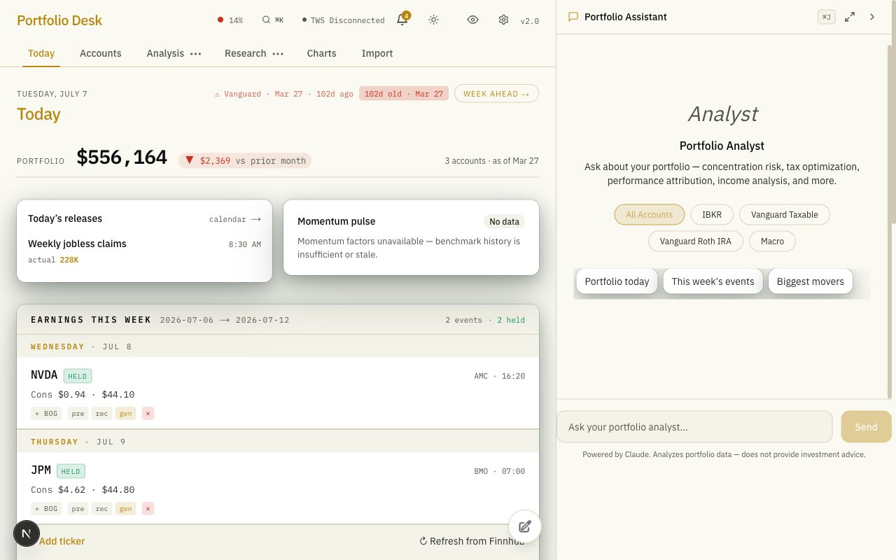
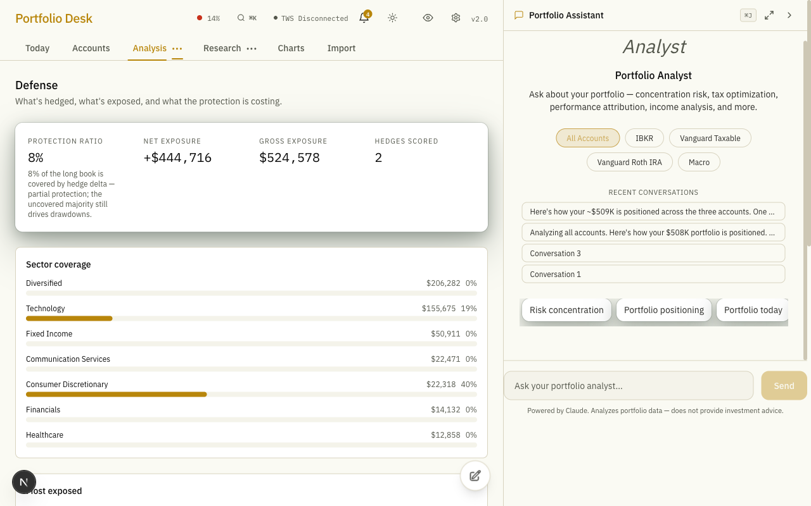
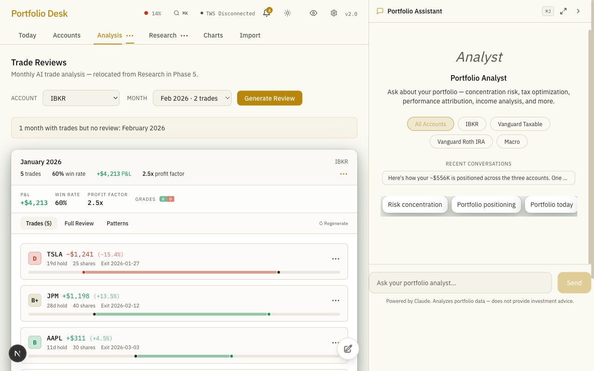
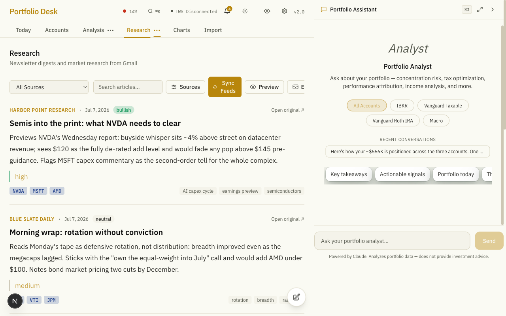
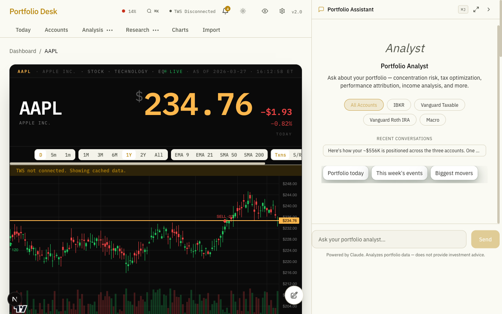
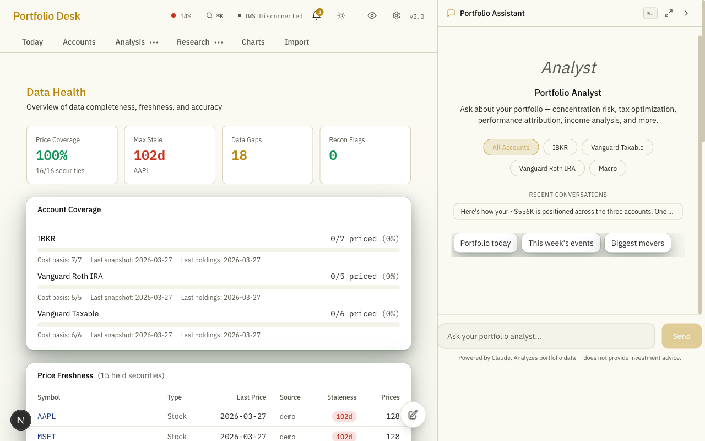
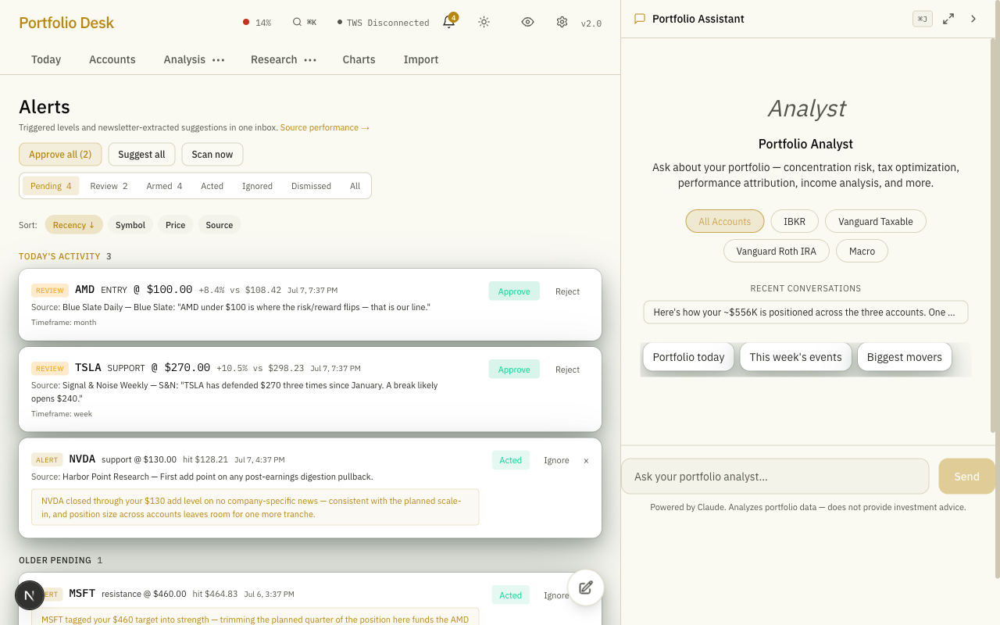

# Portfolio Desk

[](LICENSE)
[](CHANGELOG.md)
[](#for-developers)
[](https://nextjs.org)
[](https://www.electronjs.org/)

**Your entire investment life in one private dashboard — on your own computer.**

Portfolio Desk pulls together everything you own across Vanguard, Interactive Brokers, and retirement accounts, keeps it current automatically, and adds an AI research assistant that actually knows your portfolio. It briefs you by email every morning and evening, warns you before every earnings report for companies you own, pings your phone when a stock crosses a price you care about, and answers questions like *"how did my tech positions do this quarter?"* in plain English.

All of your financial data lives in a single database file on your Mac. Nothing is uploaded to any server except the AI requests you choose to make.

> The repository is named `vanguard-skin` for historical reasons — the app itself is **Portfolio Desk**.



---

## What you get

### 📊 Every account in one place

Import your Vanguard statements (just drop the PDF on the Import tab — AI reads it for you), your IBKR activity files, or statements from any other broker via a universal spreadsheet format. The app reconstructs your full history: every purchase, sale, dividend, and transfer. Re-importing the same statement twice is always safe — nothing duplicates.

Holdings from all accounts roll up into one view, including stocks, ETFs, mutual funds, options, bonds, and even foreign-currency positions (converted at real broker exchange rates, never guessed).

### 🔄 Stays current by itself

Connect to Interactive Brokers and your positions, cash, and prices refresh automatically every 30 minutes. If IBKR's desktop software isn't running, the app quietly falls back to IBKR's web connection instead — your dashboard stays fresh either way, even while you travel. A confidence indicator in the header always tells you exactly how fresh your data is.

### 💬 An AI assistant that knows *your* portfolio

Chat with Claude from any screen (a keyboard shortcut away). It has direct, read-only access to your actual holdings, trade history, performance numbers, tax lots, research notes, press releases, analyst coverage, and earnings transcripts — 27 different data sources in all. Ask "what's my exposure to semiconductors?", "when did I last add to this position and why?", or "summarize what my newsletters said about NVDA this week" and get answers grounded in your real data, not generic commentary.

### 🌅 A "Today" screen worth opening in the morning

The default landing page is a single glance at your day: what's moving in your accounts, which economic releases and earnings reports are coming this week (and how the market reacted once they land), any price alerts that fired, and levels you're watching that are getting close. Works beautifully on your phone too.

### 📬 Briefings delivered to your inbox

- **Sunday afternoon** — a weekly briefing that reads your weekend newsletters, looks at the week ahead (Fed meetings, inflation data, earnings for companies you own), and connects it all to your actual positions.
- **Weekday mornings (8:45 AM)** — a digest of everything your research newsletters said overnight, synthesized across sources by company, so five takes on the same stock become one coherent story.
- **Weekday evenings** — a recap of the session: what your newsletters covered, plus any of your holdings that moved unusually hard relative to the market.
- **Around every earnings report you have a stake in** — a preview email ~2 hours before the call with Wall Street's expectations laid out line by line (printable, so you can fill in actuals by hand while listening), and a recap after the numbers land with the actual results, the stock's reaction, and how it compares to what analysts expected.

These emails keep arriving **even when your Mac is asleep or you're traveling** — a small cloud backup service composes and sends them if your computer doesn't respond, and everything is de-duplicated so you never get the same email twice.

### 🔔 Price alerts that reach your phone

Set price levels on anything you own or watch — a fixed price, or a moving average like the 50-day. When the price crosses your level, you get a push notification on your phone with a one-sentence AI recommendation, and the alert lands in an inbox in the app so nothing gets lost. The moment a company you own reports earnings, your phone gets the headline numbers too.

Better yet: the app reads your subscribed newsletters and **extracts the price levels your analysts mention** ("I'd buy NVDA at 165"). You approve or reject each one, and approved levels arm themselves and fire like any other alert. Over time, the app scores each newsletter author on how often their levels actually held — so you learn who's worth listening to.

### 📰 Your newsletters become a research library

Connect the Gmail account where your investment newsletters arrive and every issue is automatically fetched, summarized, tagged by sentiment, and linked to the tickers it mentions. Search across everything, read cleaned-up versions without the email clutter, and see every article that ever mentioned a stock right on that stock's page. Got a PDF report or a good article from somewhere else? Forward it to your personal research address or drop the file in, and it joins the library too.

### 📈 Analysis that answers real questions

- **Performance** — true time-weighted and money-weighted returns per account and across accounts, computed the way institutions do it (so deposits and withdrawals don't distort your numbers).
- **Risk** — drawdown, volatility, Sharpe ratio, concentration, and each position's contribution to your overall risk.
- **Factor exposure** — how tilted you are toward growth vs. value, large vs. small, sectors and geographies, benchmarked against an index that fits each account.
- **Scenarios** — "what happens to my portfolio if the market drops 20%?" Nine presets (crashes, rate shocks, sector rotations) plus build-your-own, with position-level impact estimates.
- **Defense** — a dedicated view that finds your hedges (puts, shorts, inverse positions), matches them against what they're protecting, and scores how much protection you're actually getting for what it costs you.
- **Classification** — your true allocation by sector, geography, size, and style, with ETFs split into their underlying sector weights and options counted under the company they reference.

### 🧾 Tax season, handled

Every sale is matched to its purchase lots automatically (FIFO), wash sales are detected, and you can export a ready-to-file Form 8949 CSV or a TurboTax file. Bonds and options are handled correctly, including the fiddly details most tools get wrong.

### 🎓 An honest review of your own trading

Once a month (or whenever you ask), the AI reconstructs every round-trip trade you closed, asks you a few questions about your thinking, and writes a review: a letter grade per trade, what worked, what didn't, and patterns across the period — written like a sharp colleague, not a cheerleader. Each account gets reviewed against its own style (active trading vs. buy-and-hold).

### 🔍 A deep-dive page for every security

Click any ticker anywhere in the app to open its hub: price chart with your buys and sells marked on it, support/resistance levels, your positions across accounts, tax lots, notes, earnings history, analyst coverage, news mentions from your newsletters, and AI trade grades. Add a price alert by clicking directly on the chart.

### 🔒 Private by design

- Your data is one SQLite file on your Mac. There is no cloud account, no sign-up, no telemetry.
- A **privacy toggle** in the header masks every dollar amount, percentage, and share count in one click — for screen-sharing or working in public. Market data (index prices, public quotes) stays visible.
- Outbound emails describe positions without exact dollar amounts.
- Imported statements can optionally back up to your own private cloud storage bucket — insurance against losing your Mac, under your own account.

### 🖥 On your desk and in your pocket

- **Native macOS app** (one-command DMG build) with a menu-bar tray showing your portfolio total, auto-connect to IBKR, and background refresh — or run it in any browser.
- **Phone-first mobile layout** with bottom navigation, reachable from anywhere via a private network tunnel.
- **Two looks**: a warm amber light theme and a Bloomberg-style dark theme, one click apart.

---

## Screenshots

<details>
<summary>Today (default landing)</summary>


</details>

<details>
<summary>Accounts — all holdings across accounts</summary>


</details>

<details>
<summary>Analysis — allocation, factors, performance</summary>


</details>

<details>
<summary>Defense — hedge detection and scoring</summary>


</details>

<details>
<summary>Charts</summary>


</details>

<details>
<summary>Trade Reviews</summary>


</details>

<details>
<summary>Research Feeds</summary>


</details>

<details>
<summary>Security Detail — terminal-style market data</summary>


</details>

<details>
<summary>Data Health</summary>


</details>

<details>
<summary>AI Chat</summary>


</details>

<details>
<summary>Alerts inbox</summary>


</details>

<details>
<summary>Import</summary>


</details>

---

## Getting started

You'll need a Mac (or any machine for the browser version), [Node.js 20+](https://nodejs.org), and an [Anthropic API key](https://console.anthropic.com/) for the AI features. Everything else is optional.

```bash
# 1. Get the code
git clone https://github.com/itsme188/vanguard-skin.git
cd vanguard-skin

# 2. Install
npm install

# 3. Add your AI key
cp .env.local.example .env.local
#    → open .env.local and paste your Anthropic API key

# 4. Run
npm run dev
```

Open **http://localhost:3000** — the database is created automatically on first launch.

### Try it with sample data first

Want to explore before importing your own statements?

```bash
npx tsx scripts/seed-demo.ts --replace
```

This fills the dashboard with six months of realistic fictional data across three accounts. (Every screenshot in this README uses this demo data.)

### Desktop app

Build the native macOS app (Apple Silicon) with one command — `npm run electron:pack` produces a DMG in `dist/`. The desktop app adds a menu-bar tray with your portfolio total, auto-connect to IBKR, and background refresh. With Apple Developer credentials it builds code-signed and notarized; without them it still works locally.

### Optional connections

Each of these unlocks a feature; skip any you don't need. All are free unless noted.

| Connect… | …and you get |
|----------|--------------|
| **IBKR Trader Workstation** or IBKR web login | Live positions, prices, streaming quotes, historical charts |
| **Gmail** (read-only) | Newsletter ingestion, research library, digests |
| **Resend** (email service, free tier) | Briefings, digests, and earnings emails delivered to your inbox |
| **Pushover** (~$5 one-time phone app) | Price alerts and earnings prints pushed to your phone |
| **FRED** (free API key) | Economic calendar: Fed meetings, CPI, jobs reports, GDP |
| **Finnhub** (free API key) | Earnings dates and analyst estimates for stocks you own |
| **Cloudflare** (free tier) | Emails and alerts keep working while your Mac is asleep; statement backup |

Detailed setup for each is in [`.env.local.example`](.env.local.example) and the collapsible sections below.

<details>
<summary>IBKR setup</summary>

To use live-data features (position sync, streaming quotes, charting):

1. Open Trader Workstation and log in
2. Go to **Edit → Global Configuration → API → Settings**
3. Enable **"ActiveX and Socket Clients"**
4. Set Socket Port to **7496**
5. Add **127.0.0.1** to Trusted IPs
6. Set `IBKR_ACCOUNT_CODE` in your `.env.local`

The dashboard header shows a connection indicator. Everything that doesn't need live data (imports, analysis, chat, research) works without IBKR entirely. If you also configure IBKR's web-API OAuth credentials, the app can refresh holdings and prices even when Trader Workstation is closed.

</details>

<details>
<summary>Importing your data</summary>

The Import tab accepts these files — drag and drop, review the preview, confirm:

| Format | Source |
|--------|--------|
| PDF statements | Vanguard monthly/quarterly statements (read by AI) |
| Activity / holdings / cost-basis CSVs | Interactive Brokers, Vanguard exports |
| Monthly values CSV | Manual entry of account totals |
| Canonical CSV | **Any broker** — a simple universal spreadsheet format |

Every import is validated before anything is written (dates, quantities, sanity checks), shows you a preview with record counts, and can be undone as a batch. Re-importing the same file never creates duplicates.

For brokers without a dedicated parser, the Import tab includes a prompt builder that converts any statement into the universal format with one paste into Claude.

</details>

<details>
<summary>Environment variables (full reference)</summary>

Copy `.env.local.example` to `.env.local`. Only the first is required:

| Variable | Purpose |
|----------|---------|
| `ANTHROPIC_API_KEY` | **Required** — all AI features (PDF reading, chat, briefings, reviews) |
| `IBKR_ACCOUNT_CODE` | Your IBKR account ID for live sync |
| `FRED_API_KEY` | Economic calendar |
| `FINNHUB_API_KEY` | Earnings dates + analyst estimates |
| `API_NINJAS_API_KEY` | Earnings call transcripts |
| `EDGAR_CONTACT_EMAIL` | SEC filings access |
| `RESEND_API_KEY`, `RESEND_FROM_DOMAIN`, `BRIEFING_EMAIL_TO` | Outbound email |
| `GMAIL_ADDRESS`, `GMAIL_APP_PASSWORD` | Newsletter fetch via IMAP |
| `GOOGLE_CLIENT_ID`, `GOOGLE_CLIENT_SECRET`, `GOOGLE_REFRESH_TOKEN` | Newsletter fetch via Gmail OAuth |
| `PUSHOVER_APP_TOKEN`, `PUSHOVER_USER_KEY` | Phone push notifications |
| `CLOUDFLARE_ACCOUNT_ID`, `CLOUDFLARE_GATEWAY_ID` | AI cost tracking per feature |
| `R2_BUCKET_NAME`, `R2_ACCESS_KEY_ID`, `R2_SECRET_ACCESS_KEY`, `R2_ACCOUNT_ID` | Statement backup to your own cloud bucket |
| `CRON_SHARED_SECRET`, `WORKER_MARKER_URL` | Cloud email fallback while your Mac sleeps |

</details>

---

## How your data is protected

- **Local-first**: one SQLite database file at `data/vanguard.db` on your machine. No cloud account, no analytics, no tracking.
- **AI calls are opt-in by feature**: the only data that leaves your machine goes to Anthropic (or through your own Cloudflare gateway) for the specific AI features you use.
- **Emails avoid exact amounts**: outbound briefings describe positions by name and share count context, never your dollar values or cost basis.
- **The optional cloud backup is your own bucket**, under your own Cloudflare account — the project has no server of its own.

---

## For developers

<details>
<summary>Tech stack</summary>

| Layer | Technology |
|-------|-----------|
| Framework | Next.js 16 (App Router), React 19, TypeScript 5 |
| Database | SQLite via better-sqlite3 (WAL mode, foreign keys, FTS5) — 63 numbered migrations |
| Styling | Tailwind CSS 4, dual-theme token system, IBM Plex Sans + Mono |
| Charts | Recharts (portfolio), LightweightCharts v5 (candlesticks) |
| AI | Claude via AI SDK v6 + Cloudflare AI Gateway; tier-based model routing (frontier / workhorse / cheap) with a live callability catalog and automatic failover when a model is unavailable |
| Broker APIs | IBKR TWS via `@stoqey/ib`, plus headless IBKR Web API (OAuth 1.0a) as a TWS-free fallback |
| Email | Resend (outbound), Gmail IMAP/OAuth (inbound newsletters) |
| Push | Pushover |
| Cloud resilience | Cloudflare Worker (single 15-min cron) + KV dedup markers + R2 state snapshots — composes and sends briefing/digest/evening/earnings emails, scans price levels, fetches newsletters, and enriches calendar events whenever the Mac is unreachable |
| Storage | Cloudflare R2 (S3-compatible via `aws4fetch`) for PDF archival + nightly state snapshots |
| Desktop | Electron + electron-builder (code-signed, notarized macOS DMG) |
| Testing | Vitest — 3213 tests across 311 files (in-memory SQLite), plus a separate Worker test suite |

</details>

<details>
<summary>Architecture</summary>

```
app/                        Next.js App Router pages + API routes
  dashboard/                6-tab UI (Today | Accounts | Analysis | Research | Charts | Import)
    security/[id]/          Per-security detail hub
    today/                  Default landing (desktop + mobile)
    alerts/                 Unified alerts inbox
  api/                      80+ API endpoints
lib/
  db.ts                     SQLite singleton; db/migrations/ has 63 numbered SQL migrations
  queries/ + mutations/     Read/write DB modules — every function takes a `db` parameter (DI for testing)
  compute/                  Engines: TWR, XIRR, tax lots, risk, scenarios, Greeks, hedging, exposure, FX
  import/parsers/           9 format parsers + validation
  tws/ + ibkr/              TWS socket API + headless Web API (OAuth)
  calendar/                 Event sourcing (WSH, FRED, Finnhub), enrichment, briefings
  digest/                   Email composers (digest, evening, briefing, earnings)
  gmail/ + research-*/      Newsletter ingestion, sanitization, document extraction
  chat/                     27 database-grounded chat tools, per-scope personas
  ai/                       Feature→model routing, tier resolution, AI Gateway
  alerts/                   Level detection, alert firing, push, scan cycle
workers/cron/               Cloudflare Worker — cron dispatch + full cloud-fallback mirrors
electron/                   Desktop main process, tray, settings store
tests/                      3213 tests (Vitest, in-memory SQLite)
```

Data flow for imports: **Detect format → Parse → Validate → Preview → Confirm → Commit**, with deterministic source keys so re-imports are no-ops. Conventions, invariants, and design decisions are documented in [`CLAUDE.md`](CLAUDE.md) and [`docs/DECISIONS.md`](docs/DECISIONS.md).

</details>

<details>
<summary>Testing</summary>

```bash
npx vitest run                # full suite
npx vitest                    # watch mode
cd workers/cron && npx vitest run   # Cloudflare Worker suite
```

All tests use in-memory SQLite for isolation. `npx next build` catches type/build issues that tests don't.

</details>

See [CHANGELOG.md](CHANGELOG.md) for version history.

---

## License

[MIT](LICENSE)
