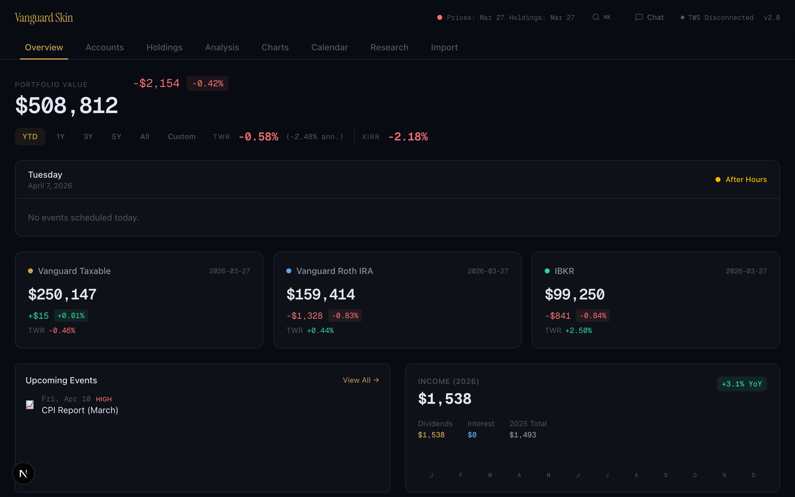
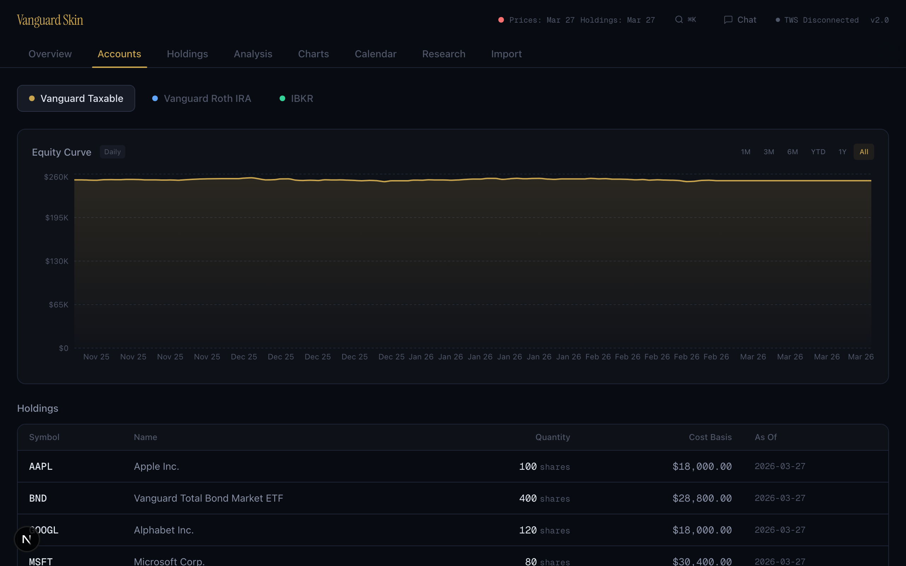
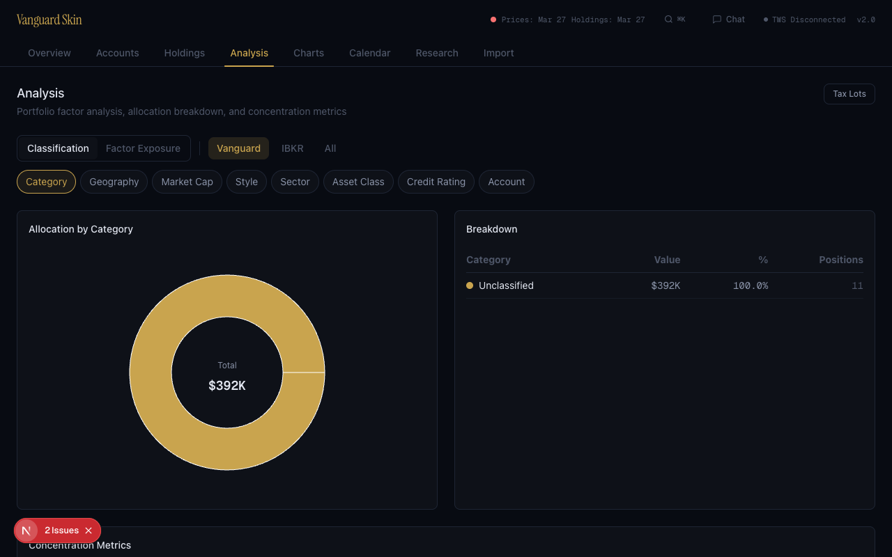
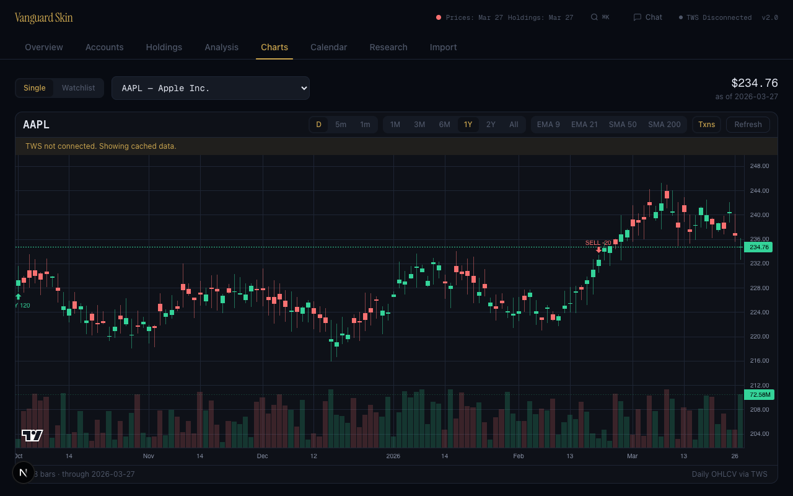
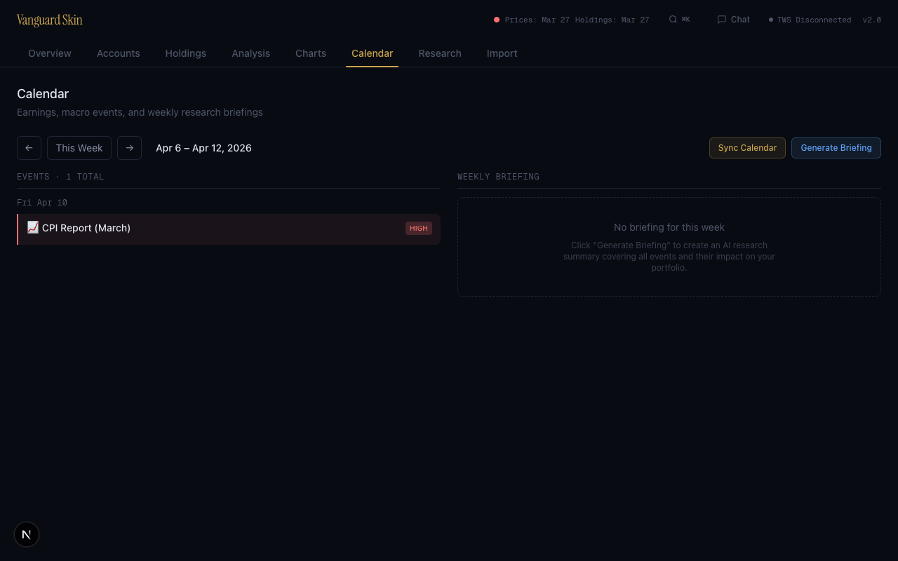
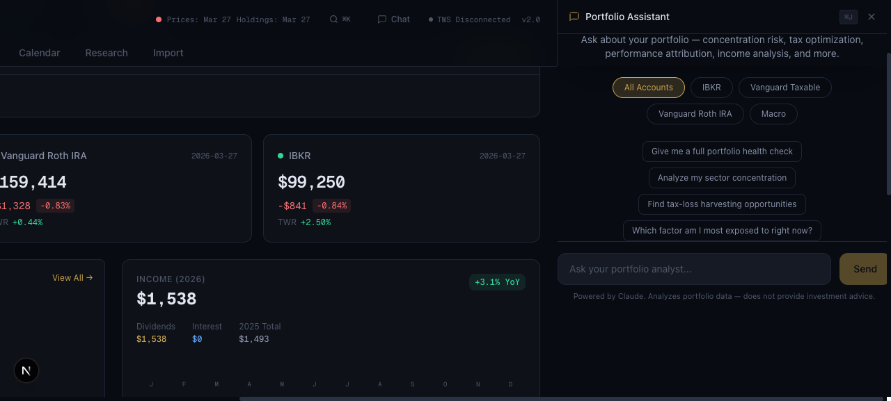
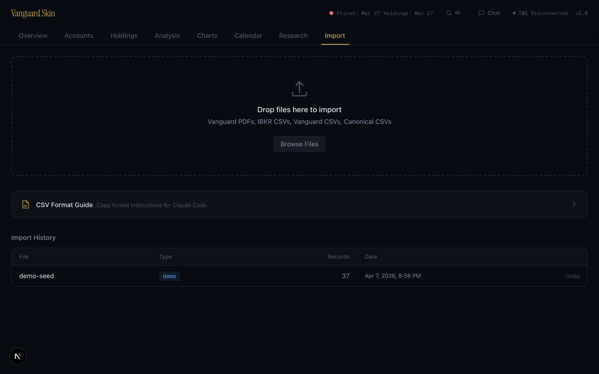

# Vanguard Skin

[](LICENSE)
[](https://nextjs.org)
[](https://typescriptlang.org)
[](#testing)

A local-first portfolio dashboard for tracking Vanguard and Interactive Brokers investments. Import brokerage statements, sync live positions via TWS, and analyze your portfolio with AI-powered chat and automated research briefings.



---

## Features

<table>
<tr>
<td width="33%" valign="top">
<h3>Portfolio Overview</h3>
Combined equity curves across all accounts with daily resolution. Performance metrics (TWR, XIRR) for YTD, 1Y, 3Y, 5Y, and custom date ranges. Benchmark comparison against SPY, QQQ, and VTI.
</td>
<td width="33%" valign="top">
<h3>Multi-Source Import</h3>
Import Vanguard PDF statements (parsed via Claude AI), IBKR activity CSVs, cost basis CSVs, and monthly value snapshots. Deterministic deduplication ensures re-imports are safe.
</td>
<td width="33%" valign="top">
<h3>Live TWS Integration</h3>
Sync positions, account balances, and streaming quotes directly from IBKR Trader Workstation. Historical OHLCV bars for per-security candlestick charting with technical indicators.
</td>
</tr>
<tr>
<td width="33%" valign="top">
<h3>AI Chat</h3>
Ask questions about your portfolio using Claude with 14 database tools. Agentic loop with multi-step tool use per query, grounded entirely in your real portfolio data.
</td>
<td width="33%" valign="top">
<h3>Tax Lot Tracking</h3>
FIFO cost lot matching with short-term/long-term classification. Realized and unrealized gain/loss by year, account, and security. Supports stocks, options, and bonds.
</td>
<td width="33%" valign="top">
<h3>Research Calendar</h3>
Earnings dates and company events via IBKR Wall Street Horizon. Macro events (FOMC, CPI, jobs) from FRED. AI-generated weekly briefings with automated email delivery.
</td>
</tr>
<tr>
<td width="33%" valign="top">
<h3>Risk Analytics</h3>
Max drawdown analysis, portfolio volatility, Sharpe ratio, and concentration metrics (Herfindahl index). Per-account and combined portfolio views.
</td>
<td width="33%" valign="top">
<h3>Factor Analysis</h3>
Thematic factor exposure heatmap with AI-powered auto-classification. Tracks exposure to macro themes like AI, rates, energy, and international markets.
</td>
<td width="33%" valign="top">
<h3>Dark Theme</h3>
"Midnight Portfolio" design system with navy-black surfaces, warm gold accents, and tabular number formatting. Designed for extended use with high readability.
</td>
</tr>
</table>

---

## Screenshots

<details>
<summary>Account Details</summary>


</details>

<details>
<summary>Analysis</summary>


</details>

<details>
<summary>Charts</summary>


</details>

<details>
<summary>Calendar</summary>


</details>

<details>
<summary>AI Chat</summary>


</details>

<details>
<summary>Import</summary>


</details>

---

## Tech Stack

| Layer | Technology |
|-------|-----------|
| Framework | Next.js 16, React 19 |
| Language | TypeScript 5 |
| Database | SQLite via better-sqlite3 (WAL mode) |
| Styling | Tailwind CSS 4 |
| Charts | Recharts (portfolio), LightweightCharts v5 (candlestick) |
| AI | Claude API via AI SDK v6 |
| Broker API | IBKR TWS via @stoqey/ib |
| Testing | Vitest (492 tests) |

---

## Quick Start

### Prerequisites

- **Node.js 20+** (via Homebrew: `brew install node`)
- **npm 10+**
- **Anthropic API key** ([get one here](https://console.anthropic.com/)) -- required for PDF parsing and AI chat
- **IBKR Trader Workstation** (optional) -- for live data features

### Setup

1. **Clone the repository**
   ```bash
   git clone https://github.com/itsme188/vanguard-skin.git
   cd vanguard-skin
   ```

2. **Install dependencies**
   ```bash
   npm install
   ```

3. **Configure environment variables**
   ```bash
   cp .env.local.example .env.local
   ```
   Edit `.env.local` and add your Anthropic API key at minimum. See [Configuration](#configuration) for all available options.

4. **Start the development server**
   ```bash
   npm run dev
   ```

5. **Open http://localhost:3000** in your browser

The SQLite database is created automatically on first run.

### Demo Data

To explore the dashboard with sample data before importing your own:

```bash
npx tsx scripts/seed-demo.ts --replace
```

This populates the database with 6 months of fictional portfolio data across three accounts.

---

## Configuration

<details>
<summary>Environment Variables</summary>

Copy `.env.local.example` to `.env.local` and configure:

**Required:**
| Variable | Description |
|----------|-------------|
| `ANTHROPIC_API_KEY` | Claude API key for PDF parsing and chat |

**Required for TWS features:**
| Variable | Description |
|----------|-------------|
| `IBKR_ACCOUNT_CODE` | Your personal IBKR account ID (e.g., `U12345678`) |

**Optional:**
| Variable | Description |
|----------|-------------|
| `FRED_API_KEY` | FRED economic calendar data ([free registration](https://fred.stlouisfed.org/docs/api/api_key.html)) |
| `EDGAR_CONTACT_EMAIL` | SEC EDGAR API fair access email |
| `API_NINJAS_API_KEY` | Earnings transcripts ([api-ninjas.com](https://api-ninjas.com/)) |
| `GMAIL_ADDRESS` | Gmail address for sending weekly briefings |
| `GMAIL_APP_PASSWORD` | Gmail App Password ([setup guide](https://support.google.com/accounts/answer/185833)) |
| `BRIEFING_EMAIL_TO` | Briefing email recipient |

</details>

<details>
<summary>IBKR TWS Setup</summary>

To use live data features (position sync, streaming quotes, charting):

1. Open TWS and log in
2. Go to **Edit > Global Configuration > API > Settings**
3. Enable **"ActiveX and Socket Clients"**
4. Set Socket Port to **7496**
5. Add **127.0.0.1** to Trusted IPs
6. Set `IBKR_ACCOUNT_CODE` in your `.env.local`

The dashboard header shows a TWS connection indicator. Features that require TWS (position sync, streaming quotes, OHLCV charts) will show connection prompts when TWS is not running. All other features (import, analysis, chat) work without TWS.

</details>

<details>
<summary>Importing Data</summary>

The Import tab supports these file formats:

| Format | Source | Notes |
|--------|--------|-------|
| PDF statements | Vanguard | Monthly/quarterly account statements, parsed via Claude AI |
| Activity CSVs | IBKR | Activity statements from Client Portal |
| Holdings CSVs | IBKR | Current holdings snapshot |
| Cost Basis CSVs | Vanguard | Cost basis export |
| Monthly Values CSV | Manual | Manual entry of monthly account totals |

Drag and drop files onto the Import tab. The app detects the format automatically, shows a preview with record counts and sample data, and asks for confirmation before writing to the database. Re-importing the same file is safe -- duplicate records are skipped via deterministic source keys.

</details>

---

## Architecture

```
app/                        Next.js App Router pages + API routes
  dashboard/                Main dashboard with tab navigation
  api/                      15+ API endpoints (import, compute, chat, TWS, calendar)
lib/
  db.ts                     SQLite singleton (WAL mode, foreign keys ON)
  db/migrations/            14 numbered SQL migrations
  queries/                  Read-only database functions
  mutations/                Write database functions
  compute/                  TWR, XIRR, tax lots, risk metrics, daily valuations
  import/parsers/           7 format-specific parsers
  tws/                      IBKR TWS API integration (positions, streaming, charts)
  calendar/                 Event sourcing, briefing generation, email delivery
tests/                      492 tests (Vitest, in-memory SQLite)
scripts/                    Utility scripts (seed demo data, generate fixtures)
```

All database functions accept a `db` parameter for dependency injection, enabling fast in-memory testing without touching disk.

---

## Testing

```bash
# Run all tests
npx vitest run

# Run tests in watch mode
npx vitest

# Run a specific test file
npx vitest run tests/compute/tax-lots.test.ts
```

492 tests across 45 test files covering the import pipeline, tax lot computation, TWR/XIRR calculations, daily valuations, risk metrics, benchmark analytics, and chat tools.

---

## License

[MIT](LICENSE)
